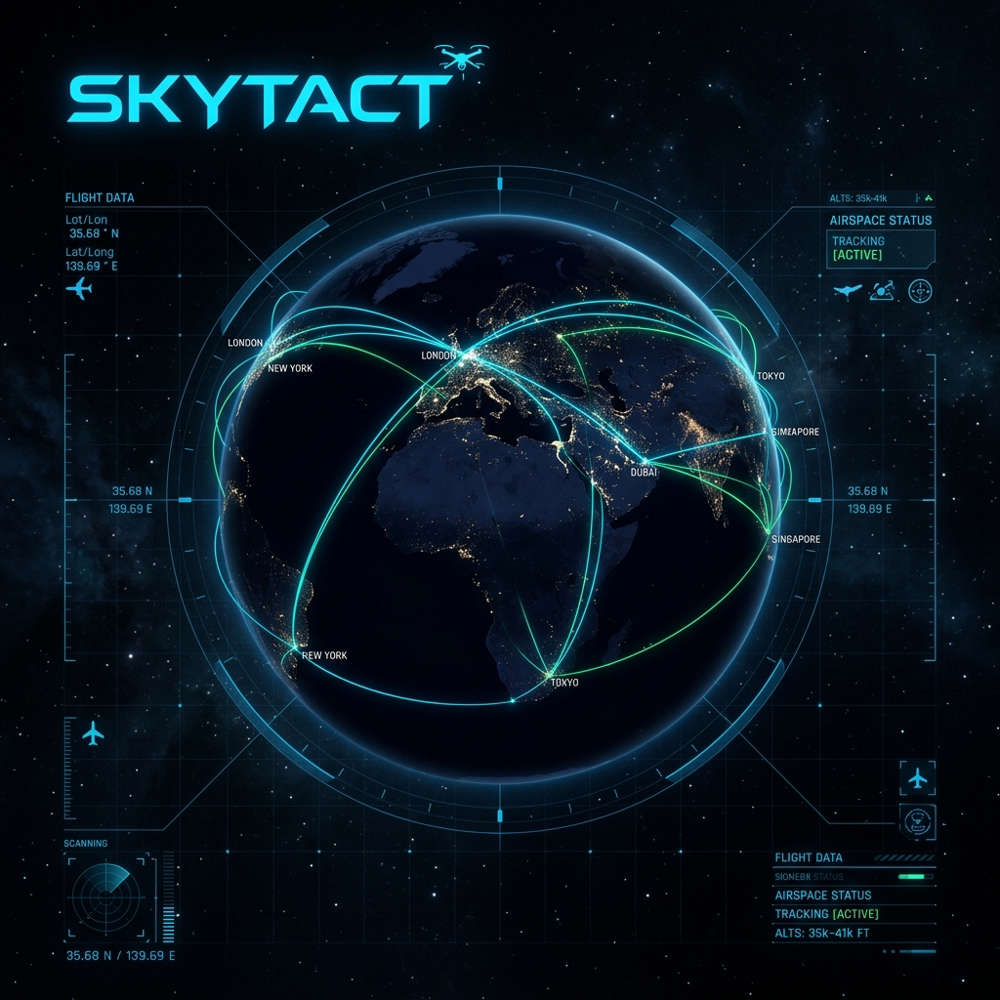
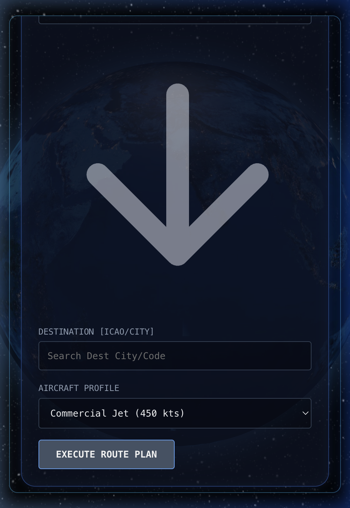
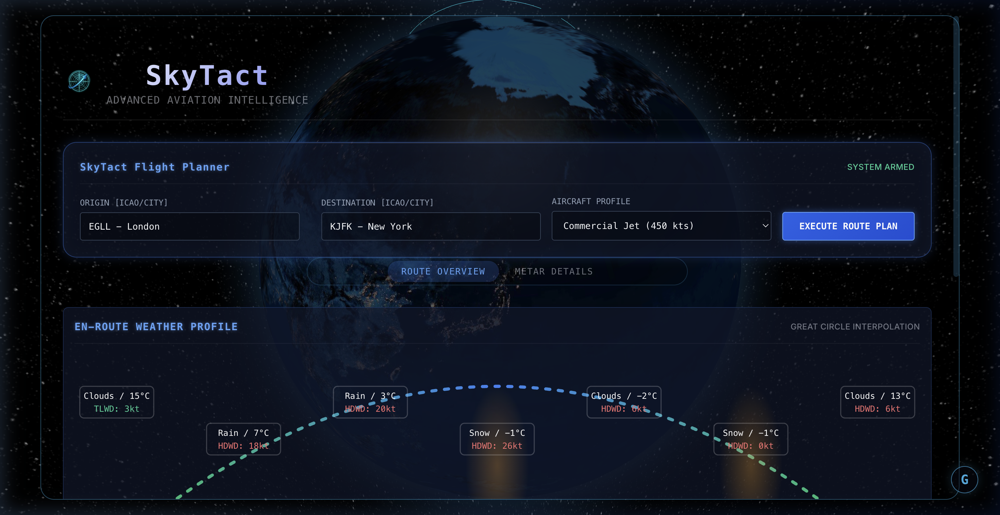

# 🛫 SkyTact: Advanced Aviation Intelligence



> **Status**: Mission Ready. Deploying Tactical HUD... ⚡

---

## 📽️ Mission Preview


---

## 🛰️ The "Origin" Story: From 0.1 to MACH 1.0

We've all been there. Every budding developer has a "Weather App" sitting in their repository graveyard—a generic grid, some semi-opaque white cards, and an OpenWeatherMap API call that looks exactly like a thousand others.

**SkyTact** was nearly one of those. 

I thought about deleting it. Instead, I decided to gut the architecture, strip the "glassmorphism" fluff, and build something that felt like it belonged in a G550 flight deck. I traded basic clouds for **Great Circle Arcs**, generic temperatures for **METAR data feeds**, and simple 2D lists for a **high-precision 3D global visualization engine**.

SkyTact is the result of that transformation: a professional-grade aviation intelligence dashboard designed for situational awareness at a glance.

---

## 🚀 Core Mission Features

### 🌍 Performance-Based Geospatial HUD
The heart of SkyTact is an interactive 3D globe powered by **Three.js** and **WebGL**. It's not just for show—flight paths are procedurally generated and styled based on aircraft performance:
- **Commercial Jets (≥400 kts)**: Neon Cyan solid paths with high-frequency dash animations.
- **Turboprops (≥200 kts)**: Golden Yellow dashed lines for medium-speed visual cues.
- **General Aviation (<200 kts)**: Tactical Green dotted paths reflecting slower travel profiles.

### 🗺️ Invisible Dashboard Design
Built on a "Hud-First" philosophy, the interface is a **95% width wide-screen tactical pane**. By purging blurs and opaque backgrounds, we've achieved a "completely transparent" dashboard that lets you see the world behind the data.

### ⛈️ Real-Time Aviation Intelligence
- **METAR Data Stream**: Live weather reports directly from `aviationweather.gov`.
- **En-Route Profiling**: Vertical profile visualization of Great Circle routes with interpolated weather and hazard detection.
- **Glossary HUD**: A minimalist, floating 'G' button for instant layman-friendly definitions of complex aviation terms (VFR, MVFR, IFR, etc.).

---

## 🛠️ Technical Flight Deck

| Logic | Visualization | Data | Styles |
|---|---|---|---|
| **React 18** | **React-Globe.gl** | **AviationWeather API** | **Tactical CSS** |
| **Vite** | **Three.js** | **OpenWeatherMap** | **Responsive HUD** |

---

## 📱 Multi-Device Command
SkyTact is fully responsive. Whether you're in a desktop control center or holding an iPad on the ramp, the interface adapts:
- **Desktop**: 1800px wide-screen tactical HUD.
- **Mobile**: Single-column stacked inputs with optimized padding and touch-safe interaction (3D tilt disabled for stability).



---

## 🔧 Deployment Manual

### Prerequisites
- Node.js (v18+)
- OpenWeatherMap API Key

### 1. Initialization
Clone the repository and install dependencies:
```bash
git clone https://github.com/sosush/SkyTact.git
cd SkyTact
npm install
```

### 2. Environment Configuration
Create a `.env` file in the root directory:
```env
VITE_WEATHER_API_KEY=your_openweathermap_api_key_here
```

### 3. Launch
Deploy the local development server:
```bash
npm run dev
```

---

## 📸 Tactical Recon (Screenshots)

### Mission Control (Home)


---

## 🛡️ License
Distributed under the MIT License. Fly safe.

---
**Crafted with ⚡ and Altitude.**
